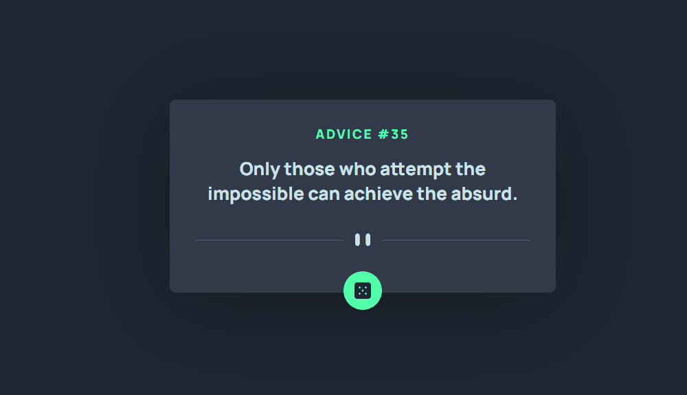

<h1 align = 'center'> Advice generator app </h1>

 

 

## About the Project

This is a project from [Frontend Mentor](https://www.frontendmentor.io/challenges/advice-generator-app-QdUG-13db/hub) that generate a random advice when clicked on the dice button.
I did this project using an API named [Advice Slip](https://api.adviceslip.com/) that gives to me the random advices datas.

 

 

 

<h3 align = 'center'><a href = 'https://jhowbrcg.github.io/article-preview-component/'>See the project</a></h3>

 

## Creator

| Author                                                                                                                                      |
| ------------------------------------------------------------------------------------------------------------------------------------------- |
| <a target="_blank" href="https://github.com/JhowBRCG"> </a> |
| &nbsp; &nbsp; &nbsp; Jhonathan                                                                                                              |

